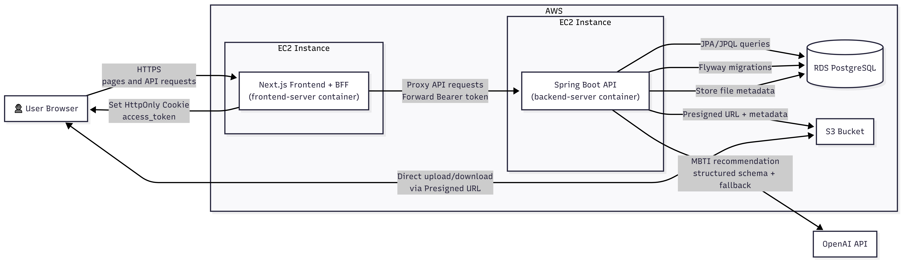
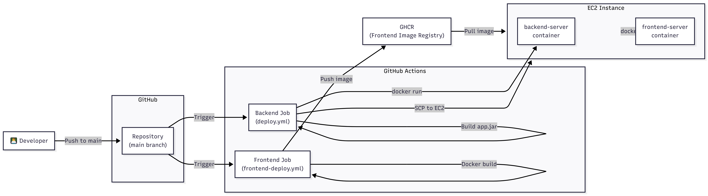

## Architecture

### Runtime Architecture

- Next.js를 BFF로 사용하여 API 요청을 집계하고 HttpOnly Cookie 기반 인증을 처리합니다.
- 클라이언트는 직접 백엔드에 접근하지 않으며, 모든 `/api/*` 요청은 BFF를 통해 프록시됩니다.
- Spring Boot는 JPA 기반 데이터 처리 및 RBAC 2계층 권한 제어를 수행합니다.
- 파일 업로드는 Presigned URL을 발급하여 S3와 브라우저 간 직접 통신하도록 설계했습니다.
- AI 기반 MBTI 추천은 Spring AI를 통해 OpenAI API와 연동하며, structured output + fallback 전략을 적용했습니다.

---

### CI/CD Architecture

- GitHub Actions를 통해 main 브랜치 push 시 자동 배포됩니다.
- Backend는 app.jar 빌드 후 EC2로 전송(SCP)하여 Docker 컨테이너로 실행합니다.
- Frontend는 Docker 이미지를 빌드 후 GHCR에 push하고, EC2에서 pull하여 실행합니다.
- Flyway와 ddl validate 설정으로 배포 시 스키마 안정성을 확보했습니다.

## Tech Stack

### Backend
| 기술 | 버전 | 채용 이유 |
|---|---:|---|
| Java | 17 | LTS 기반 안정적인 서버 런타임 |
| Spring Boot | 3.5.9 | 표준 백엔드 프레임워크 |
| Spring Data JPA | - | JpaRepository + 파생 메서드 + `@Query` 중심 조회/CRUD |
| Querydsl | - | 복잡한 검색/동적 조건 조회에 선택 적용 |
| Spring Security + JWT | - | Stateless 인증 구성 |
| RBAC (2계층 권한) | - | URL Role + Method Authority 이중 접근 제어 |
| PostgreSQL | - | 운영 안정성 높은 RDB |
| Flyway + ddl validate | - | 마이그레이션/스키마 검증 기반 배포 안정성 |
| AWS S3 (Presigned URL) | - | 파일 업로드/다운로드 처리 |
| Spring AI + OpenAI | gpt-4o-mini | MBTI 추천 AI (schema 제약 + fallback 적용) |

### Frontend / BFF
| 기술 | 버전 | 채용 이유 |
|---|---:|---|
| Next.js (BFF) | 14.2.5 | BFF 계층으로 API 집계/인증 처리 |
| HttpOnly Cookie Auth | - | 토큰 노출 최소화(클라이언트 저장소 회피) |
| next-intl | - | 다국어 지원(ko/en/ja) |
| Chart.js / Recharts | - | 대시보드/통계 시각화 |

### Infrastructure / DevOps
| 기술 | 버전 | 채용 이유 |
|---|---:|---|
| AWS EC2 | - | 서비스 호스팅 |
| AWS RDS (PostgreSQL) | - | 운영 DB |
| AWS S3 | - | 파일 저장소 |
| Docker (Compose 포함) | - | 로컬 개발환경/배포 실행환경 표준화 |
| GitHub Actions | - | Backend 빌드 중심 CI 및 배포 자동화 |