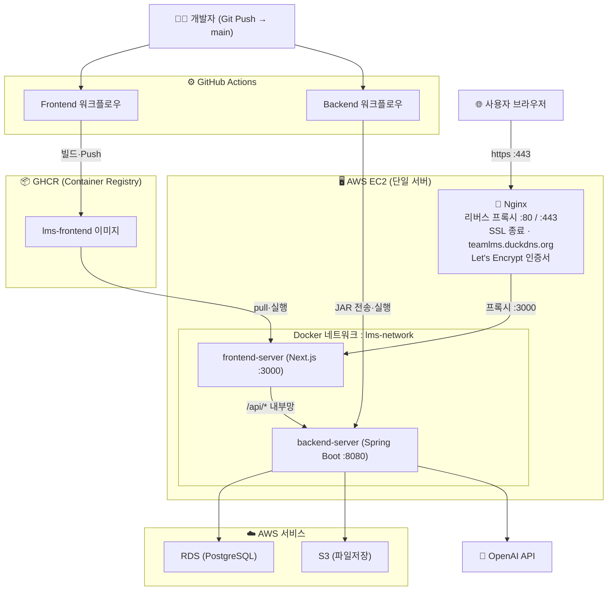
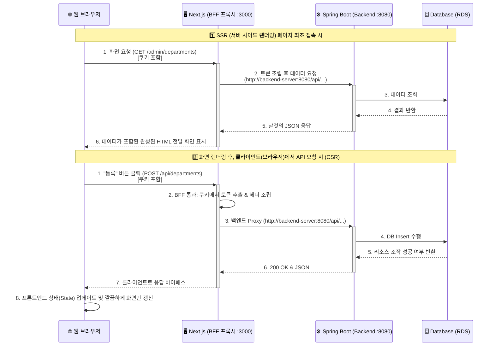

# 전체 배포 아키텍처

### 시스템 구성도



---

## 1. CI/CD 배포 파이프라인 (GitHub Actions)

두 개의 GitHub Actions 워크플로우가 서로 다른 방식으로 코드를 빌드하고 EC2에 배포합니다.

### 🖼️ 프론트엔드 배포 방식 (`frontend-deploy.yml`)
프론트엔드는 파일 복잡도(Node.js 환경, 모듈 등)를 완벽히 통제하기 위해 코드와 실행 환경을 모두 합쳐 **하나의 거대한 도커 이미지**로 구워서 배포합니다.

**트리거**: `main` push 시점 중 `frontend/**` 폴더가 변경될 때만 실행

| 단계 | 작동 설명 |
|------|-----------|
| **① 개발자 Push** | 코드를 GitHub `main` 브랜치에 반영 |
| **② Docker 빌드** | GitHub 서버가 텅 빈 상자(도커)를 열고 OS 세팅 → Node.js 18 설치 → 의존성 모듈 설치 → Next.js 빌드까지 마친 뒤 **실행에 필요한 알맹이만 압축해 1개의 독립된 이미지**로 만듭니다. (Multi-stage 빌드) |
| **③ GHCR 보관** | 구워진 빵(도커 이미지)을 GitHub Container Registry라는 무료 도커 창고에 저장합니다. 이때 최신 버전(`latest`) 태그를 붙입니다. |
| **④ EC2 원격명령** | SSH로 EC2 서버에 몰래 접속해서 과거 버전을 정지·삭제합니다. |
| **⑤ 새 버전 실행** | GHCR 창고에서 방금 만든 최신 버전을 다운로드(`docker pull`) 한 후, 3000번 포트로 즉시 기동(`docker run`)합니다. |

### ⚙️ 백엔드 배포 방식 (`deploy.yml`)
백엔드는 이미 Java라는 강력한 가상머신 위에서 돌아가도록 설계되어 있습니다. 매번 무거운 도커 이미지를 통짜로 구울 필요 없이, 핵심 실행 파일인 **`.jar` 하나만 만들어서 EC2로 쏜 뒤, 가벼운 공식 자바 껍데기 이미지에 갈아끼우는 방식**을 사용해 배포 속도를 높였습니다.

**트리거**: `main` 브랜치에 push 될 때마다 무조건 실행

| 단계 | 작동 설명 |
|------|-----------|
| **① 자바 빌드** | GitHub 가상 서버에 Java 17을 깔고, 우리 소스코드를 모아 `./gradlew build` 명령어로 단일 실행 파일인 **`app.jar` 1개를 생성**합니다. |
| **② SCP 파일전송** | 완성된 `.jar` 파일을 **SCP(보안 복사)** 방식을 이용해 GitHub 서버에서 직접 우리 EC2 서버(`~/app/app.jar`)로 쏘아 보냅니다. (프론트엔드처럼 중간 창고(GHCR)를 거치지 않습니다) |
| **③ EC2 원격명령** | SSH로 서버에 접속해서 과거 돌고 있던 자바 컨테이너를 강제 정지하고 지웁니다. |
| **④ 껍데기 결합** | 가벼운 '공식 자바 도커 이미지(`eclipse-temurin`)'를 5초 만에 다운받습니다. 이 껍데기 이미지에게 명령을 내립니다.<br/>*"안에 뼈대 환경만 제공하고, 실행 알맹이는 아까 도착한 저 `app.jar` 파일로 해!"* |
| **⑤ 환경변수 주입** | RDS(DB 주소), 비밀번호 등 민감한 Secrets 정보를 껍데기 이미지에 주입하여 즉시 기동(`docker run`)합니다. |

---

## 2. EC2 컨테이너 환경 구성

단일 EC2 서버 내에서 두 컨테이너가 가상 네트워크(`lms-network`)로 통신하여 외부 노출을 최소화합니다.

```
EC2 인스턴스
├── Nginx (호스트 직접 설치 - :80 / :443)
│   └── SSL 종료 후 → localhost:3000 프록시
└── lms-network (Docker 내부망)
    ├── frontend-server (Next.js :3000)
    └── backend-server  (Spring Boot :8080)
```

| 구성요소 | 역할 및 환경 통제 |
|---|---|
| **Nginx** | **SSL 종료**: Let's Encrypt 인증서로 HTTPS 처리<br/>**리버스 프록시**: `https://teamlms.duckdns.org` → `localhost:3000` 으로 프록시<br/>**자동 갱신**: Certbot 크론탭으로 90일마다 인증서 자동 갱신 |
| **frontend-server** | **SSR(서버 사이드) 통신**: `API_BASE_URL=http://backend-server:8080` (내부망 직통)<br/>**CSR(클라이언트) 통신**: `NEXT_PUBLIC_API_URL=https://teamlms.duckdns.org` (Nginx 경유) |
| **backend-server** | **Secrets 연동**: DB 계정, AWS S3 무결성 키, OpenAI API 키 등을 환경변수로 주입받아 구동<br/>**리소스 최적화**: 저사양 EC2를 우려하여 JVM 메모리를 384MB로 고정 (`-Xms384m`) |

---

## 3. AWS 관리형 서비스

| 서비스 | 역할 |
|--------|------|
| **EC2** | 프론트엔드 + 백엔드 컨테이너 실행 |
| **RDS (PostgreSQL 16)** | 전체 도메인 데이터 (학과·설문·멘토링·역량 등) 저장 |
| **S3** | 프로필 이미지, 공지사항 첨부 이미지, 비교과 세션 동영상 등 **사용자가 업로드하는 모든 정적 파일 저장소** (Presigned URL 도입으로 백엔드 부하 없이 안전하게 직행 업로드 구현) |
| **OpenAI API** | AI 어드바이저 채팅 기능 제공 |

---

## 4. DB 마이그레이션 (Flyway)

초기 세팅과 테이블 변경 시 **별도의 DBA 작업 없이 코드로 DB 스키마를 관리**하기 위해 **Flyway**를 도입했습니다.

애플리케이션이 실행될 때마다 버전에 맞춰 자동으로 SQL 파일을 찾아 실행해 줍니다.
```
backend/src/main/resources/db/migration/
├── V1__init.sql (초기 테이블 생성)
├── V2__account.sql (계정 관련 초기 데이터)
├── ...
└── V13__competency.sql (역량 진단 테이블 추가)
```
- 테이블이나 컬럼을 추가/수정해야 할 때, 새로운 버전(V숫자__)의 SQL 파일만 Git에 올리면, 다음 번 EC2 서버 배포 시 백엔드가 켜지면서 **자동으로 DB에 반영**됩니다.
- 버전을 추적하므로 이미 반영된 버전은 무시되어 안전하게 스키마 롤백과 이력 관리가 가능합니다.

---

## 5. 보안 및 네트워크 통제 (Security Rules)

- **AWS Security Group (SG / 인바운드 보안 규칙)**
  - `포트 22 (SSH)`: GitHub Actions 서버 IP와 지정된 관리자 IP에서만 접근 가능하도록 허용
  - `포트 80 (HTTP)`: Nginx가 수신 → `https://` 로 자동 리다이렉트
  - `포트 443 (HTTPS)`: Nginx가 수신 → SSL 종료 후 Next.js(3000)로 프록시. **사용자 실제 접속 포트**
  - `포트 3000`: Next.js 직접 접속용 (Nginx 도입 후 외부 노출 불필요, 추후 닫아도 무방)
  - `포트 8080`: 백엔드 API 서버 (BFF 패턴으로 Next.js 내부에서 호출, 추후 닫아도 무방)
  - `포트 5432`: RDS 접근은 외부에서 불가능하며, 오직 이 EC2 서버 내부 IP에서만 접속 가능하도록 원천 차단

- **GitHub Secrets**: SSH 키, DB 자격증명, API 키 모두 Secrets에 저장 → 소스코드 내 하드코딩 완전 방지
- **JWT 토큰 인증**: Spring Security 기반, 모든 API는 역할별(`ADMIN`, `PROFESSOR`, `STUDENT`) 권한 검증 진행
- **컨테이너 네트워크 격리**: 프론트엔드와 백엔드는 EC2 안에서 `lms-network`라는 Docker 가상망으로 묶여있어 내부 통신 시 외부망을 타지 않고 안전하게 초고속 통신합니다.

---

## 6. AI 어드바이저 (OpenAI API 연동 - MBTI 진로 추천)

본 서비스는 학생의 **MBTI 검사 결과와 관심 직무 키워드**를 바탕으로 개인화된 직업 추천 사유를 생성하기 위해 OpenAI API를 활용합니다. 단순한 챗봇 문답 방식이 아닌, **시스템 프롬프트 기반의 RAG 데이터 조립 및 엄격한 JSON 구조화 출력(Structured Output)** 패턴으로 동작합니다.

- **Spring AI 프레임워크 활용**: 백엔드에서 `Spring AI`의 `ChatClient`를 이용해 **gpt-4o-mini** 모델과 통신하며, 응답 형식을 JSON(`OUTPUT_SCHEMA`)으로 강제하여 서비스 로직에 안전하게 파싱합니다.
- **RAG 컨텍스트 주입 및 연동 흐름**:
  1. 클라이언트가 추천 요청 시, 백엔드는 해당 학생의 **MBTI 유형, 8가지 상세 지표 점수(E, I, S, N, T, F, J, P), 그리고 사용자가 선택한 관심 키워드 2개 이상**을 DB에서 조회합니다.
  2. 백엔드 내부 알고리즘으로 이 키워드들과 일치율이 높은 직업 후보군(Job Candidate) 상위 40개를 추려냅니다.
  3. 앞서 수집한 (MBTI 정보 + 관심 키워드 + 직업 후보군 리스트)를 **System Prompt**에 텍스트로 녹여내어 OpenAI API로 전송합니다.
  4. Prompt 제약 조건에 따라 AI는 후보군 중 가장 적합한 **직업 5개**를 골라내고, 왜 이 직무가 해당 학생의 MBTI 성향과 관심사에 부합하는지 **맞춤형 추천 사유(Reason)**를 3~4문장의 한국어로 작성하여 반환합니다.
- 보안을 위해 `OPENAI_API_KEY`는 EC2 서버 환경변수에만 존재하며, 클라이언트(브라우저)는 프론트엔드 BFF를 거쳐 백엔드의 정제된 추천 결과 JSON만 받아 화면에 렌더링하므로 API 키 탈취 위험이 없습니다.

---

## 7. BFF (Backend-For-Frontend) 아키텍처 및 통신 흐름

본 시스템은 보안 강화와 CORS 브라우저 제약을 원천 차단하기 위해, Next.js의 API Routes를 활용한 **BFF(Backend-For-Frontend) 프록시 패턴**을 전면 도입했습니다. 브라우저가 백엔드로 직접 전화를 걸지 않고 무조건 중간의 프론트엔드 서버(Next.js)를 거칩니다.

### 🛡️ BFF 도입으로 얻은 핵심 이점
1. **완벽한 CORS 해결**: 브라우저는 오직 프론트엔드 도메인(`http://...:3000/api/...`)으로만 통신합니다. 브라우저 정책상 동일 출처(Same-Origin)로 인식되어 귀찮은 CORS 에러가 발생하지 않습니다.
2. **토큰 탈취 원천 차단**: 민감한 JWT Access Token을 로컬 스토리지에 두지 않습니다. 자바스크립트로 접근할 수 없는 **httpOnly 쿠키**에 구워 브라우저에 저장하고, 브라우저가 Next.js에 요청할 때마다 자동으로 실려오는 쿠키를 추출해 백엔드 API 호출 시 백단에서 `Authorization: Bearer <token>` 헤더로 변환해 찔러주는 역할을 `src/lib/bff.ts`가 수행합니다.

### 🔄 전체 사용자 요청 흐름 시나리오


